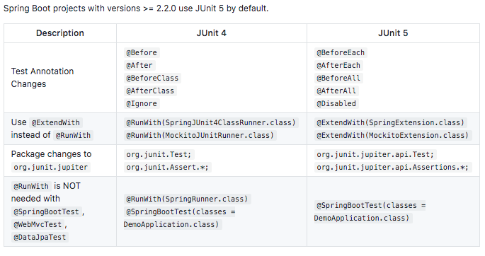

# Java Unit Testing

Java Unit 5 Testing with Spring Boot 2.3.1 and Mockito Frameworks,
JsonAssert, Hamcrest & JsonPatch.

#### Overview
Spring Boot is the most popular framework to develop
RESTful Services and it has great Unit Testing capabilities
through Spring Boot Starter Test. Mockito is the most popular
mocking framework. JUnit is the most popular Java Unit Testing framework.

This project goal is to learn to write independent and good unit tests for 
RESTful webservices talking with multiple layers: web, business and data. 

#### JUnit 5 vs Junit 4
Functionally speaking, JUnit 5 is as simple as JUnit 4.
There are just a few simple annotation changes: 

